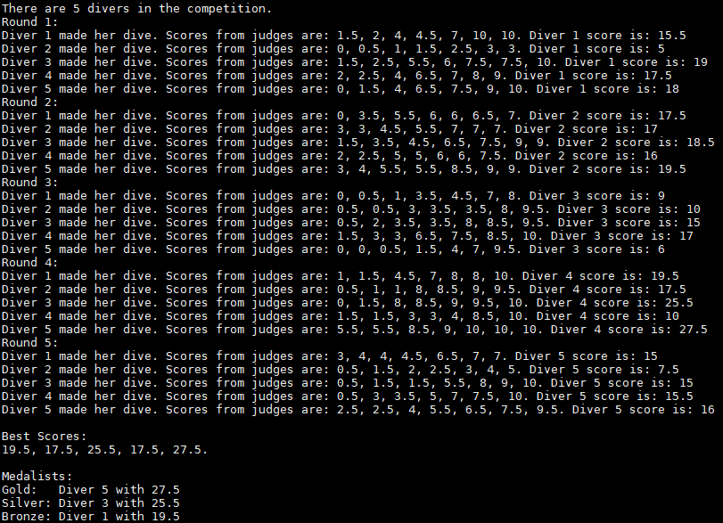
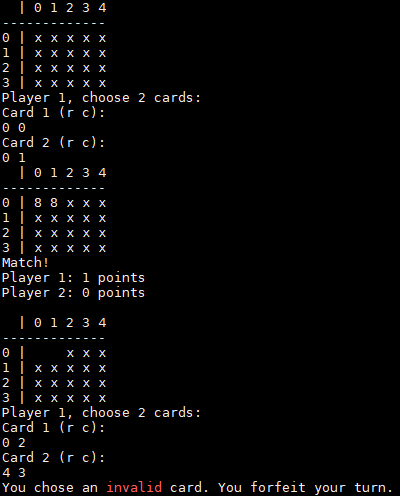
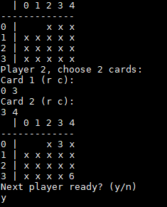
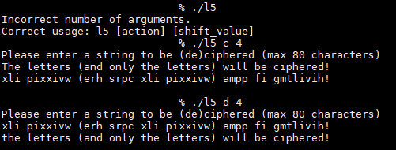
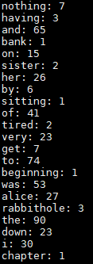

# C_Labs
Notable labs from my 2018 C Programming Class

## Lab 3
###### lab3DivingCompetitionSimulation.c
Program to simulate a diving competition. There are a random number of divers that compete in 5 rounds. A diver's score for each round is calculated by adding the judge's scores (after removing the highest and lowest scores). After all 5 rounds, the divers with the three highest scores are announced.

## Lab 4
###### lab4MemoryGame.c
Program to simulate Memory card game. Players try to remove all of the cards by finding matches. Players may only remove cards that are still on the board. Cards are flipped back over if they don't match. The player with the most points at the end of the game wins.

## Lab 5
###### lab5CaeserCipher.c
Program to cipher or decipher a string that is entered by the user. Whether to cipher or decipher and the offset are input as command line arguments. Punctuation is not affected.

## Lab 6
###### lab6LinkedListWordCount.c
Program to count the words in Alice_Ch1.txt using linked lists. The word count for each word is stored in nodes. Ignores punctuation.

